# Yapay zekâ destekli ASP.NET MVC uygulaması.
**Bilgilerim Sayfası**

- **Kullanıcı bilgilerinin tutulduğu alandır. Kullanıcı tarafından kayıt esnasında eklenebileceği gibi.OBS sisteminin de projeye dahil edilmesi ile otomatik olarak veriler çekilebilir.** 

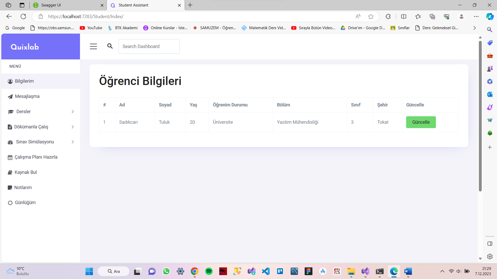

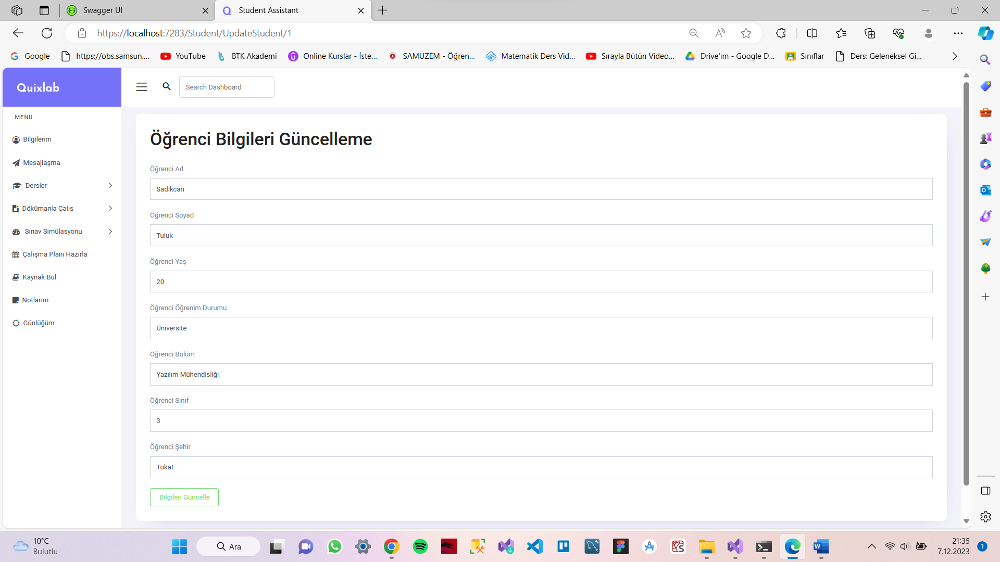

**Mesajlaşma Sayfası**

- **Kullanıcının genel sorularına cevap aldığı alandır.**

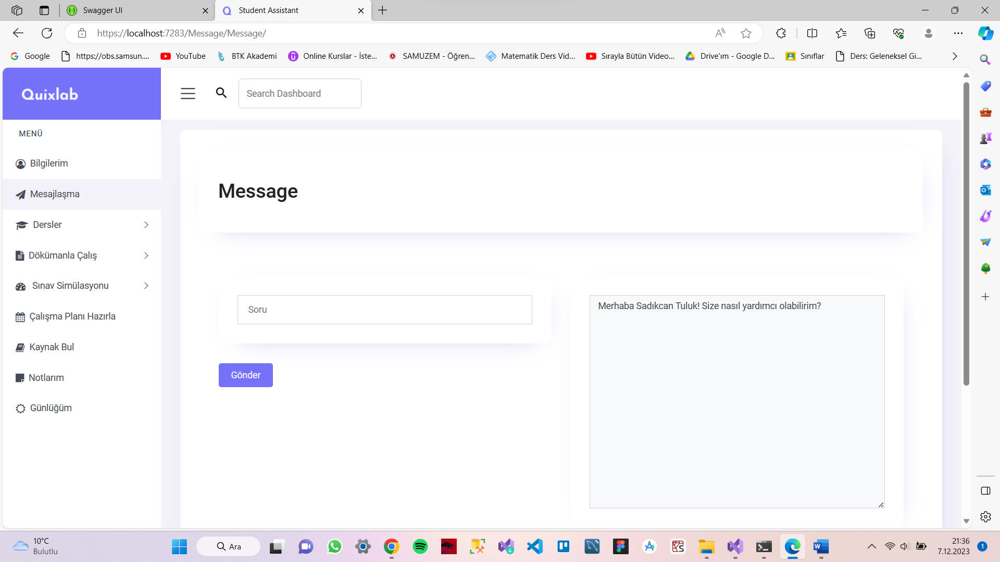

**Dersler Sayfası**

- **Kullanıcının eklediği ya da OBS sistemi üzerinden öğrencinin aldığı derslerin otomatik çekildiği alandır. Yapay zeka yardımıyla öğrenci ilgili dersiyle ilgili soru sorup cevap alır.**

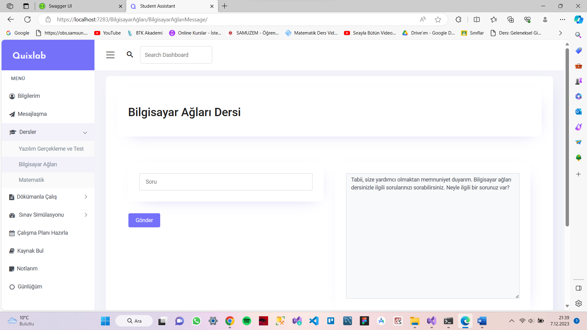

**Dökümanla Çalış Sayfası**

- **Kullanıcının cihazından doküman yüklediği ve yapay zeka yardımıyla sorularına doküman içerisinden cevap aldığı alandır.**

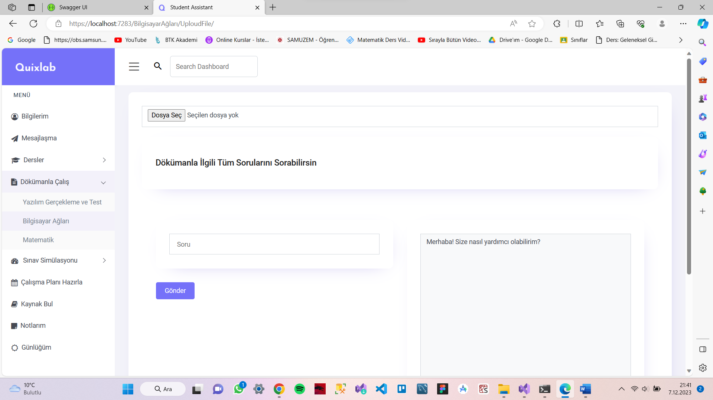

**Sınav Simülasyonu Sayfası**

- **Kullanıcı cihazından yüklenen doküman ve kullanıcı isteklerine göre (soru sayısı, sınav tipi…) sınav hazırlayan alandır.**

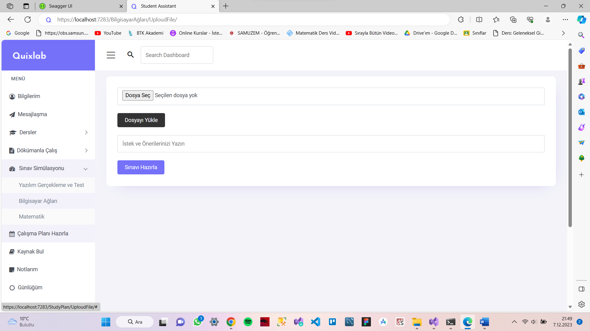

**Çalışma Planı Hazırlama Sayfası**

- **Kullanıcı cihazından yüklenen ders programı ve kullanıcı istekleri doğrultusunda (Salı günü dersim yok ama o günü kendime ayıracağım gibi) çalışma planı hazırlayan alandır.**

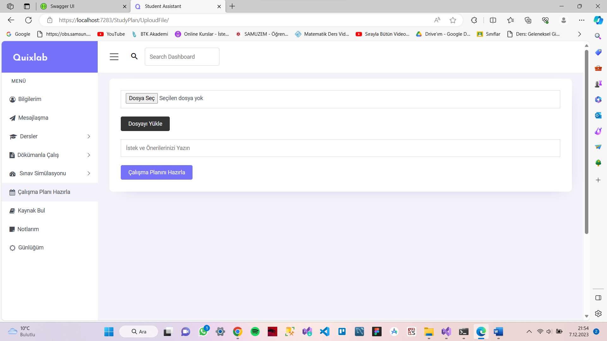

**Kaynak Bul Sayfası**

- **Öğrenci bilgileri ve uygulamaya eklenen derslere göre internet aramasıyla kullanıcıya ders ders kaynak öneren veya OBS sistemi bağlantısı sağlanmış ise direkt ‘Ders Bilgi Paketi’ alanından kaynak bilgilerini alan ve kullanıcıya sunan alandır.**

**Notlarım Sayfası**

- **Kullanıcının genel notlarını aldığı ve yönettiği alandır.**

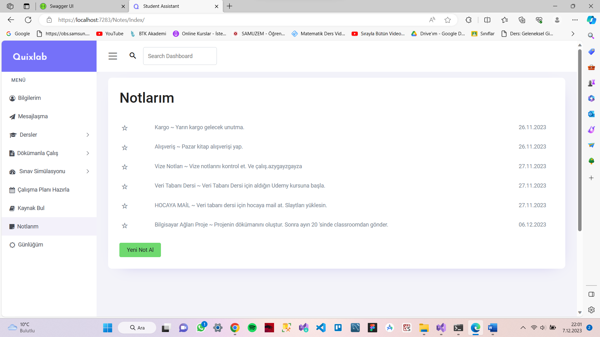

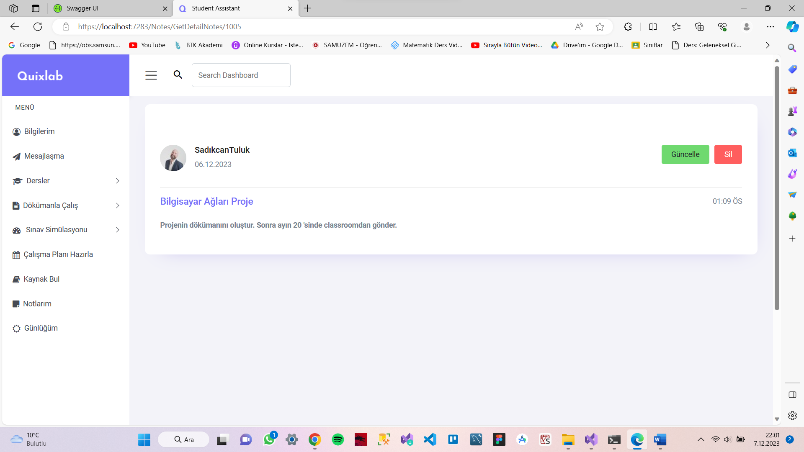

**Günlüğüm Sayfası**

- **Kullanıcın günlük yazdığı alandır.**

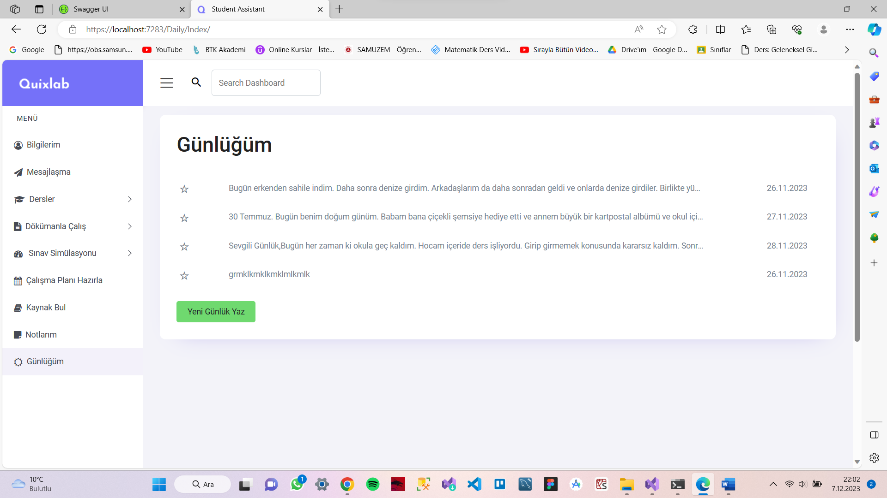

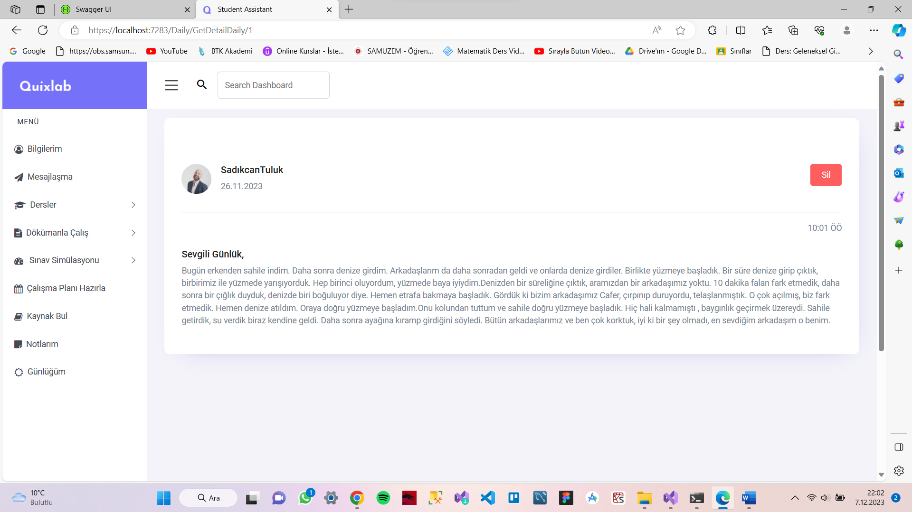